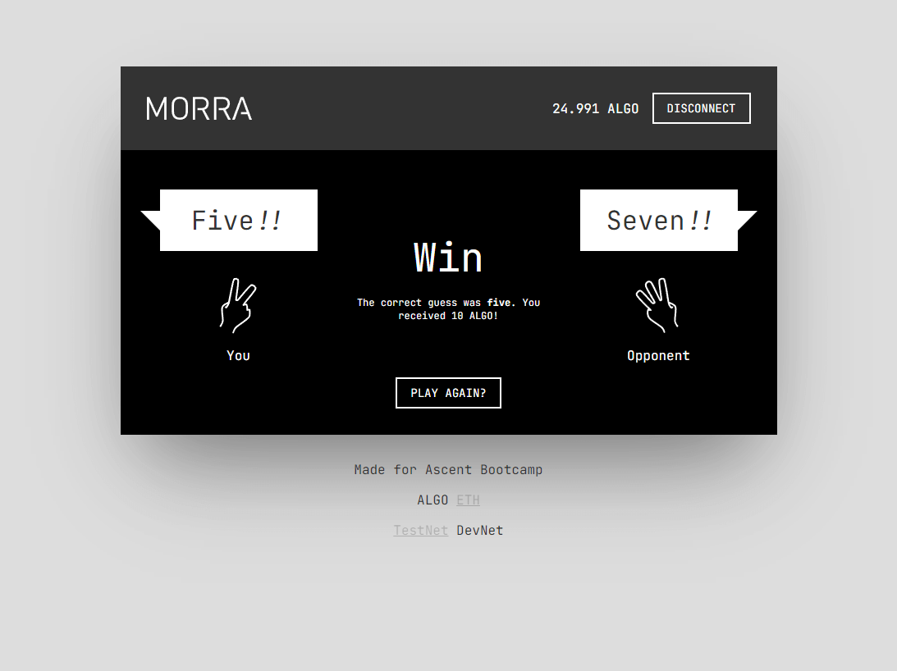

# Morra in Reach

Source code for morra made with Reach, for the Ascent Bootcamp (Cohort 2). If you need to modify the backend you must setup [Reach](https://docs.reach.sh/quickstart/) and run `./reach compile` from the backend folder.

### Prerequisites

- Git
- Node.js

### Quick start

```
git clone https://github.com/Ripe/morra-reach
cd morra-reach/frontend
npm i
npm start
```

The environment is hardcoded to use Algorand so you will need to setup a [MyAlgo](https://wallet.myalgo.com/) testnet wallet and fund it using the [testnet dispenser](https://bank.testnet.algorand.network/).

### Screenshots





