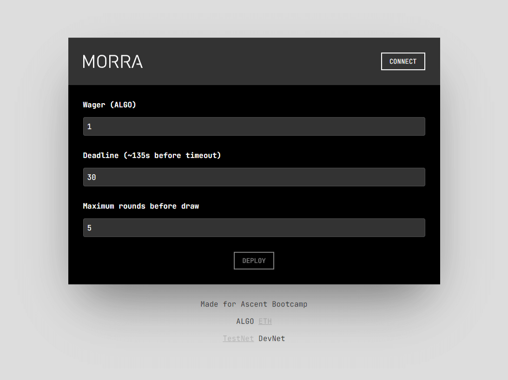
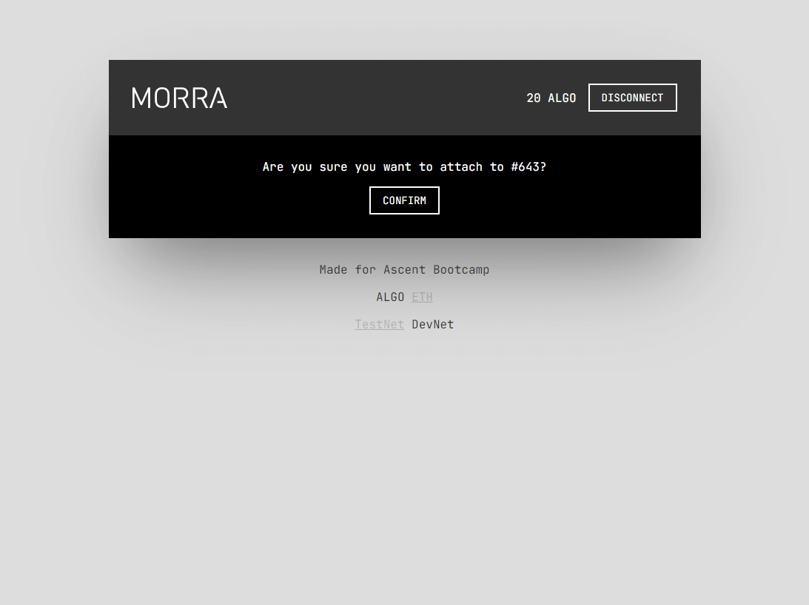

# Morra in Reach

Source code for morra made with Reach, for the Ascent Bootcamp (cohort 2).

You can play with it [here](http://dal6o4eqltj78.cloudfront.net/) by setting up a [MyAlgo testnet wallet](https://wallet.myalgo.com/) and fund it using the [testnet dispenser](https://bank.testnet.algorand.network/).

### Prerequisites

- Git
- Node.js

 If you need to modify the backend you must setup [Reach](https://docs.reach.sh/quickstart/) and run `./reach compile` from the backend folder.

### Quick start

```
git clone https://github.com/Ripe/morra-reach
cd morra-reach/frontend
npm i
npm start
```

### Screenshots






